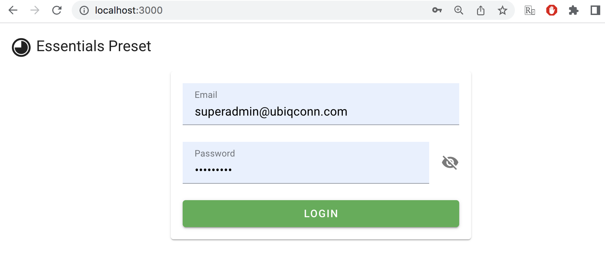
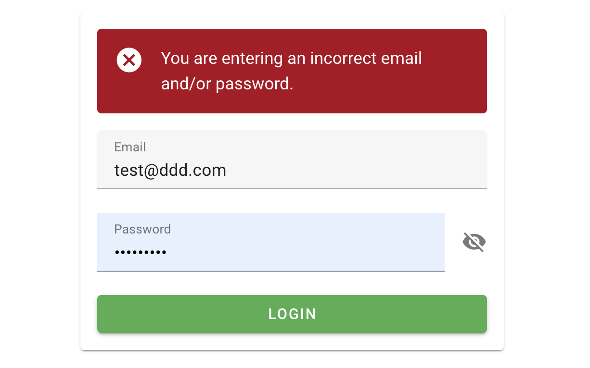
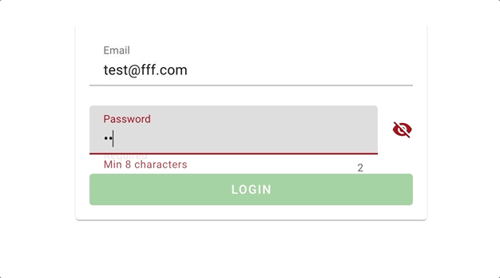
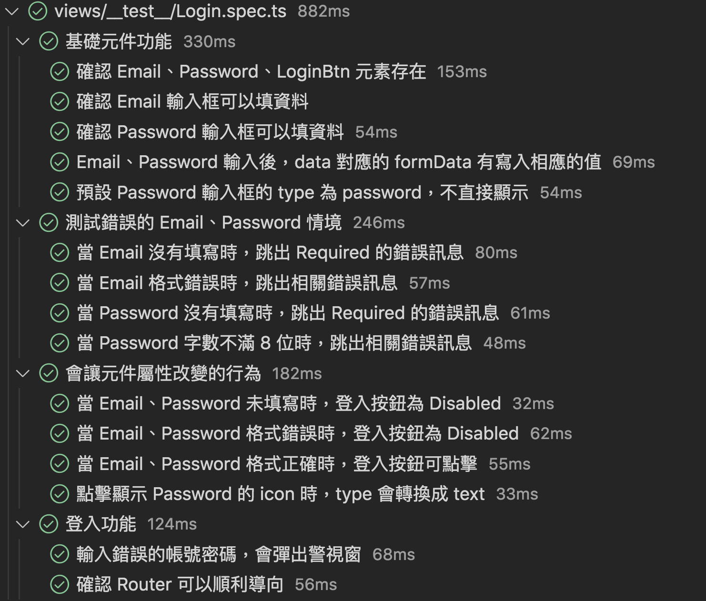

# 透過實際案例了解在 Vuetify（Vite & TypeScript）中如何運用 @vue/test-utils

[上一篇文章中](https://medium.com/dean-lin/cb1eca31eb67)，我們成功在 Vuetify（Vite & TypeScript）中導入單元測試 Unit Testing。

今天這篇文章，筆者會用一個簡易的「登入頁面」，來介紹 @vue/test-utils 這款套件的常用功能：

- 用 get 找出元素（element）
- 用 getComponent 找出元件（component）
- 用 setValue 模擬使用者對元件（component）輸入值
- 透過 wrapper.vm 取得 data 資訊
- 取得元素（element）的 attributes 屬性
- 模擬使用者點擊輸入框（focus）輸入文字，然後離開（blur）的動作
- 當操作錯誤時，能捕捉預期的 error message
- 確認使用者操作系統時，元件的 attributes 如預期改變（ex： disabled、type）
- 當元素採用 v-show 策略時，用 isVisible 進行判斷
- 模擬使用者 trigger button 事件
- 使用 Vue Router 時，頁面是否如預期跳轉

```
大綱

ㄧ、從測試的角度來設計頁面規格
二、撰寫登入頁程式
三、從測試案例了解 @vue/test-utils 常用的功能
  ▶︎ 測試檔案初始設定
  ▶︎ 用 get 找出元素（element），並確認是有顯示在畫面上的（isVisible）。
  ▶︎ 透過 getComponent 取出元件，並指定「input」來 setValue
  ▶︎ 在輸入框輸入後，用 wrapper.vm.xxx 確定 data 的有成功寫入
  ▶︎ 取得元素的 attributes，確認設定符合預期
  ▶︎ 模擬使用者點擊輸入框（focus）輸入文字，然後離開（blur）的動作；並確認操作錯誤時，能捕捉預期的 error message
  ▶︎ 使用者操作系統時，元件的 attributes 如預期改變
  ▶︎ 模擬使用者 trigger button 事件，觀察頁面是否如預期跳轉（Vue Router）
```

> 讀者可以直接到[筆者的 Github](https://github.com/dean9703111/-vuetify-vite-ts-test-exmaples)，將專案 Clone 下來跑跑看，會更好理解裏面的邏輯（順手按個 ⭐ 更好 🤩）。

### ㄧ、從測試的角度來設計頁面規格

在[第一篇文章](https://medium.com/dean-lin/60f4df934fb1)有談到 TDD（Test-Driven Development），測試驅動開發。

假使我們要設計一個登入頁，可以訂製如下規格：

#### ➤ 基礎元件功能
- 確認 email、password、LoginBtn 元素存在
- 確認 Email 輸入框可以填資料
- 確認 Password 輸入框可以填資料
- Email、Password 輸入後，data 對應的 formData 有存入相應的值
- 預設 Password 輸入框的 type 為 password，不直接顯示
#### ➤ 測試錯誤的 Email、Password 情境
- 當 Email 沒有填寫時，跳出 Required 的錯誤訊息
- 當 Email 格式錯誤時，跳出相關錯誤訊息
- 當 Password 沒有填寫時，跳出 Required 的錯誤訊息
- 當 Password 字數不滿 8 位時，跳出相關錯誤訊息
#### ➤ 會讓元件屬性改變的行為
- 當 Email、Password 未填寫時，登入按鈕為 Disabled
- 當 Email、Password 格式錯誤時，登入按鈕為 Disabled
- 當 Email、Password 格式正確時，登入按鈕可點擊
- 點擊顯示 Password 的 icon 時，type 會轉換成 text
#### ➤ 登入功能
- 輸入錯誤的帳號密碼，會彈出警視窗
- 確認 Router 可以順利導向

> 上面訂的規格，就是我們後續要測試的情境。

### 二、撰寫登入頁程式

在 views 資料夾下新增「Login.vue」來做登入頁，幾個重點說一下：

- 使用 dataset（ex：data-test="xxx"）來做標記，因為 id 或 class 通常都是因為其他用途而存在的，要是 coding 中不小心動到 id 或是 class 會造成測試不通過
- 在 v-text-field 有設計 rules 來做校驗
- valid 影響輸入按鈕是否能按，pwshow 是密碼是否顯示，loginFail 決定登入失敗的錯誤訊息是否顯示

```vue
<template>
  <div class="d-flex align-center flex-column">
    <v-card width="400">
      <v-container>
        <v-form v-model="valid" lazy-validation>
          <v-alert
            v-show="loginFail"
            type="error"
            class="mb-4"
            data-test="loginAlert"
          >
            You are entering an incorrect email and/or password.
          </v-alert>
          <v-text-field
            v-model="formData.email"
            :rules="emailRules"
            label="Email"
            required
            data-test="email"
          ></v-text-field>
          <v-text-field
            v-model="formData.password"
            :append-icon="pwShow ? 'mdi-eye' : 'mdi-eye-off'"
            :rules="[rules.required, rules.min]"
            :type="pwShow ? 'text' : 'password'"
            name="input-10-1"
            label="Password"
            hint="At least 8 characters"
            counter
            @click:append="pwShow = !pwShow"
            data-test="password"
          ></v-text-field>
          <v-spacer></v-spacer>
          <v-btn
            x-large
            block
            :disabled="!valid"
            color="success"
            @click="login"
            data-test="loginBtn"
          >
            Login
          </v-btn>
        </v-form>
      </v-container>
    </v-card>
  </div>
</template>
<script setup>
import { ref, reactive } from "vue";
import router from "@/router";
const valid = ref(true);
const pwShow = ref(false);
const loginFail = ref(false);
const formData = reactive({
  email: "",
  password: "",
});
const emailRules = [
  (v) => !!v || "Required",
  (v) => /.+@.+\..+/.test(v) || "E-mail must be valid",
];
const rules = {
  required: (value) => !!value || "Required",
  min: (v) => (v && v.length >= 8) || "Min 8 characters",
};
const login = () => {
  // 這邊只是為了方便理解，實際上應該要呼叫 api
  if (
    formData.email === "baoboa@mail.com" &&
    formData.password === "baobaocute"
  ) {
    router.push("/home");
  } else {
    loginFail.value = true;
  }
};
</script>
```

完成後在終端機輸入 `yarn dev`，然後進入網址：http://localhost:3000



> 我這邊有調整「src/router/index.ts」，將 Login 的 path 設定為「/」，讀者可以[參考 Github](https://github.com/dean9703111/-vuetify-vite-ts-test-exmaples)。

### 三、從測試案例了解 @vue/test-utils 常用的功能

這邊會取幾個測試案例來做解說，完成的範例請參考[筆者的 Github](https://github.com/dean9703111/-vuetify-vite-ts-test-exmaples)（順手點個 Star 會讓筆者會開心一整天）。

#### ▶︎ 測試檔案初始設定

我們在 views 資料夾下新增「**test**」資料夾，並新增「Login.spec.ts」的測試檔案：

- 透過 import 引入我們會使用到的方法
- 這邊透過 beforeEach 來初始化我們要測試 Login.vue

```ts
import { describe, it, expect, beforeEach, vi } from "vitest";
import { mount, VueWrapper } from "@vue/test-utils";
import Login from "../Login.vue";
import vuetify from "@/plugins/vuetify";
import router from "@/router";

let wrapper: VueWrapper<any>;
beforeEach(async () => {
  wrapper = mount(Login, {
    global: {
      plugins: [vuetify, router],
    },
  });
});
```

#### ▶︎ 用 get 找出元素（element），並確認是有顯示在畫面上的（isVisible）。

> find 也可以達到一樣的效果，但沒找到時並不會回傳錯誤訊息。

```ts
it("確認 Email、Password、LoginBtn 元素存在", () => {
  expect(wrapper.get('[data-test="email"]').isVisible()).toBe(true);
  expect(wrapper.get('[data-test="password"]').isVisible()).toBe(true);
  expect(wrapper.get('[data-test="loginBtn"]').isVisible()).toBe(true);
});
```

#### ▶︎ 透過 getComponent 取出元件，並指定「input」來 setValue

> 因為 Vuetify 的 v-text-field 是 div 層，所以需要再透過 get 往下找到 input 這個元素。

```ts
it("確認 Email 輸入框可以填資料", async () => {
  const emailInput = wrapper.getComponent('[data-test="email"]').get("input");
  await emailInput.setValue("test@mail.com");
  expect(emailInput.element.value).toBe("test@mail.com");
});
```

#### ▶︎ 在輸入框輸入後，用 wrapper.vm.xxx 確定 data 的有成功寫入

```ts
it("Email、Password 輸入後，data 對應的 formData 有寫入相應的值", async () => {
  const formData = {
    email: "test@mail.com",
    password: "qazwsx1234",
  };
  const emailInput = wrapper.getComponent('[data-test="email"]').get("input");
  await emailInput.setValue(formData.email);
  const passwordInput = wrapper
    .getComponent('[data-test="password"]')
    .get("input");
  await passwordInput.setValue(formData.password);
  expect(wrapper.vm.formData).toEqual(formData);
});
```

#### ▶︎ 取得元素的 attributes，確認設定符合預期

```ts
it("預設 Password 輸入框的 type 為 password，不直接顯示", async () => {
  const password = wrapper.getComponent('[data-test="password"]');
  expect(password.get("input").attributes().type).toBe("password");
});
```

#### ▶︎ 模擬使用者點擊輸入框（focus）輸入文字，然後離開（blur）的動作；並確認操作錯誤時，能捕捉預期的 error message

```ts
it("當 Email 沒有填寫時，跳出 Required 的錯誤訊息", async () => {
  const email = wrapper.getComponent('[data-test="email"]');
  await email.trigger("focus");
  await email.get("input").setValue("123"); //先隨便塞值
  await email.get("input").setValue("");
  await email.trigger("blur");
  const emailErrorMsg = email.get(".v-messages__message");
  expect(emailErrorMsg.text()).toEqual("Required");
});
```

#### ▶︎ 使用者操作系統時，元件的 attributes 如預期改變（ex：Email、Password 填寫正確，登入按鈕 Disabled 移除）

```ts
it("當 Email、Password 格式正確時，登入按鈕可點擊", async () => {
  const loginBtn = wrapper.get('[data-test="loginBtn"]');
  expect(loginBtn.attributes().disabled).toBeDefined();

  const formData = {
    email: "baoboa@mail.com",
    password: "baobaocute",
  };
  const email = wrapper.getComponent('[data-test="email"]');
  await email.trigger("focus");
  await email.get("input").setValue(formData.email);
  await email.trigger("blur");
  const password = wrapper.getComponent('[data-test="password"]');
  await password.trigger("focus");
  await password.get("input").setValue(formData.password);
  await password.trigger("blur");

  expect(loginBtn.attributes().disabled).toBeUndefined();
});
```

#### ▶︎ 模擬使用者 trigger button 事件，觀察頁面是否如預期跳轉（Vue Router）

```ts
it("確認 Router 可以順利導向", async () => {
  const formData = {
    email: "baoboa@mail.com",
    password: "baobaocute",
  };
  const email = wrapper.getComponent('[data-test="email"]');
  await email.trigger("focus");
  await email.get("input").setValue(formData.email);
  await email.trigger("blur");
  const password = wrapper.getComponent('[data-test="password"]');
  await password.trigger("focus");
  await password.get("input").setValue(formData.password);
  await password.trigger("blur");
  // 使用真實的 Router 測試時，若想要捕捉 Push 的行為，須透過 vi.spyOn 來模擬 router.push
  const spyPush = vi.spyOn(router, "push");
  await wrapper.get('[data-test="loginBtn"]').trigger("click");
  expect(spyPush).toHaveBeenCalledTimes(1);
  expect(spyPush).toHaveBeenCalledWith("/home");
});
```

在文章的最後，筆者也放一下所有測試的結果圖（可透過套件 or 指令 `yarn test` 執行）：



今天的文章分享到這邊，我們下次再見～